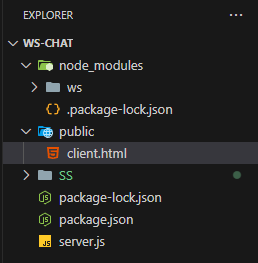
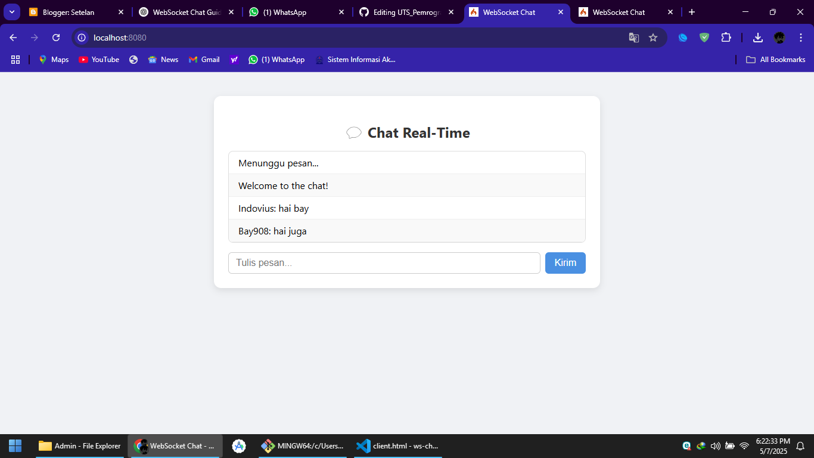

# 🚀 Panduan Lengkap: Aplikasi Chat Sederhana dengan WebSocket

## 📚 Pendahuluan
Web modern butuh komunikasi cepat seperti:
- 💬 Chat online
- 📊 Dashboard monitoring
- 🎮 Game multiplayer
- 🔔 Notifikasi instan

**WebSocket** = koneksi 2 arah yang selalu terbuka 🚀.  
Lebih cepat dan efisien dibanding HTTP biasa.

---

## 🆚 WebSocket vs HTTP

| Fitur        | HTTP               | WebSocket           |
|--------------|--------------------|---------------------|
| Koneksi      | Stateless (1 arah) | Persistent (2 arah) |
| Responsivitas| Lambat (Polling)   | Cepat (Real-time)   |
| Overhead     | Tinggi             | Rendah              |

---

## 💪 Langkah-Langkah Proyek: Chat WebSocket

### 1️⃣ Persiapan
- Install **Node.js**
- Buat folder `websocket-chat`

### 2️⃣ Struktur Folder + Kode Lengkap

```

```

#### 📄 server.js

```javascript
const WebSocket = require('ws');
const path = require('path');
const http = require('http');
const fs = require('fs');

// Buat server HTTP untuk menyajikan file HTML
const server = http.createServer((req, res) => {
  if (req.url === '/') {
    fs.readFile(path.join(__dirname, 'public', 'client.html'), (err, data) => {
      if (err) {
        res.writeHead(500);
        res.end('Error loading page');
      } else {
        res.writeHead(200, { 'Content-Type': 'text/html' });
        res.end(data);
      }
    });
  }
});

// WebSocket server
const wss = new WebSocket.Server({ server });

wss.on('connection', (ws) => {
  console.log('Client connected');

  ws.on('message', (message) => {
    console.log(`Received: ${message}`);

    // Kirim ke semua klien
    wss.clients.forEach((client) => {
      if (client.readyState === WebSocket.OPEN) {
        client.send(message);
      }
    });
  });

  ws.send('Welcome to the chat!');
});

server.listen(8080, () => {
  console.log('Server running at http://localhost:8080');
});

```

#### 📄 public/client.html

```html
<!DOCTYPE html>
<html lang="en">
<head>
  <meta charset="UTF-8" />
  <meta name="viewport" content="width=device-width, initial-scale=1.0"/>
  <title>WebSocket Chat</title>
  <style>
    body {
      font-family: 'Segoe UI', Tahoma, Geneva, Verdana, sans-serif;
      background: #f0f2f5;
      display: flex;
      flex-direction: column;
      align-items: center;
      padding: 2rem;
    }
    .chat-container {
      width: 100%;
      max-width: 600px;
      background: #fff;
      border-radius: 12px;
      box-shadow: 0 4px 12px rgba(0,0,0,0.1);
      padding: 1.5rem;
    }
    h2 {
      text-align: center;
      margin-bottom: 1rem;
      color: #333;
    }
    #chat {
      list-style: none;
      padding: 0;
      max-height: 300px;
      overflow-y: auto;
      border: 1px solid #ddd;
      border-radius: 8px;
      margin-bottom: 1rem;
    }
    #chat li {
      padding: 0.5rem 1rem;
      border-bottom: 1px solid #eee;
    }
    #chat li:nth-child(even) {
      background: #f9f9f9;
    }
    .input-area {
      display: flex;
      gap: 0.5rem;
    }
    input {
      flex: 1;
      padding: 0.5rem 0.75rem;
      border-radius: 6px;
      border: 1px solid #ccc;
      font-size: 1rem;
    }
    button {
      background: #4a90e2;
      color: white;
      padding: 0.5rem 1rem;
      border: none;
      border-radius: 6px;
      cursor: pointer;
      font-size: 1rem;
    }
    button:hover {
      background: #357ab8;
    }
  </style>
</head>
<body>

  <!-- Bagian input nama -->
  <div class="chat-container" id="login">
    <h2>Masukkan Nama Anda</h2>
    <div class="input-area">
      <input id="username" placeholder="Nama Anda..." />
      <button onclick="startChat()">Masuk</button>
    </div>
  </div>

  <!-- Bagian chat -->
  <div class="chat-container" id="chatbox" style="display:none;">
    <h2>💬 Chat Real-Time</h2>
    <ul id="chat">
      <li>Menunggu pesan...</li>
    </ul>
    <div class="input-area">
      <input id="msg" placeholder="Tulis pesan..." />
      <button onclick="send()">Kirim</button>
    </div>
  </div>

  <script>
    let ws;
    let username = '';

    function startChat() {
      const inputName = document.getElementById('username').value.trim();
      if (!inputName) {
        alert('Nama tidak boleh kosong!');
        return;
      }
      username = inputName;

      // Tampilkan chatbox, sembunyikan login
      document.getElementById('login').style.display = 'none';
      document.getElementById('chatbox').style.display = 'block';

      // Mulai WebSocket
      ws = new WebSocket('ws://' + location.host);

      ws.onmessage = async (event) => {
        const li = document.createElement('li');
        if (event.data instanceof Blob) {
          li.textContent = await event.data.text();
        } else {
          li.textContent = event.data;
        }
        document.getElementById('chat').appendChild(li);
        document.getElementById('chat').scrollTop = document.getElementById('chat').scrollHeight;
      };
    }

    function send() {
      const input = document.getElementById('msg');
      if (input.value.trim()) {
        ws.send(`${username}: ${input.value.trim()}`);
        input.value = '';
      }
    }
  </script>
</body>
</html>

```

---

## 3️⃣ Jalankan Proyek 🚀

### Instalasi package
```bash
npm init -y
npm install ws
```

### Jalankan server
```bash
node server.js
```

### Buka di browser
👉 [http://localhost:8080](http://localhost:8080)

---

## 🎯 Hasil Tampilan

Saat dijalankan, tampilannya seperti ini:

```

```

Kalau kamu buka 2 browser/tab, pesan langsung muncul di semua tab secara real-time 🔥.

---

## 🔒 Tips Keamanan WebSocket
- Gunakan `wss://` (WebSocket Secure)
- Autentikasi pengguna
- Validasi pesan masuk
- Batasi koneksi (rate limiting)
- Pakai firewall anti-DDoS

---

## ✅ Kesimpulan
Dengan WebSocket, kamu bisa bikin aplikasi **real-time** seperti:
- Chat 💬
- Game 🎮
- Dashboard 📊
- Notifikasi 🔔

**Sekarang kamu sudah siap bikin aplikasi real-time sendiri!** 🚀  
**Selamat mencoba!**
